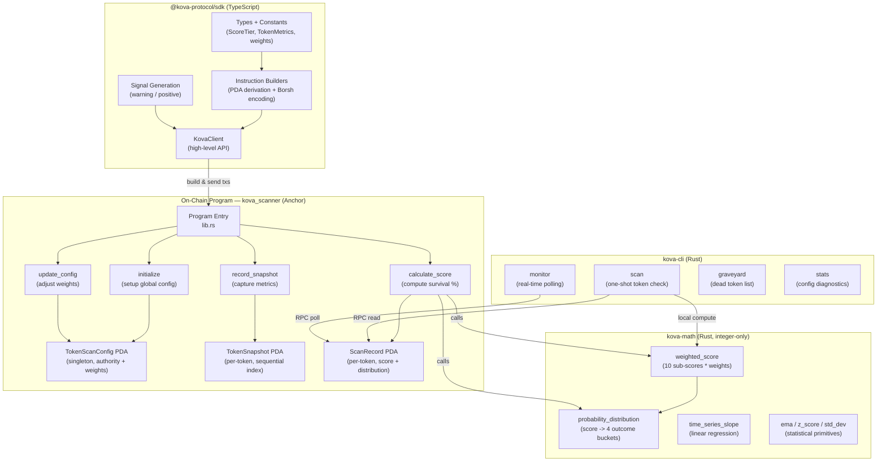
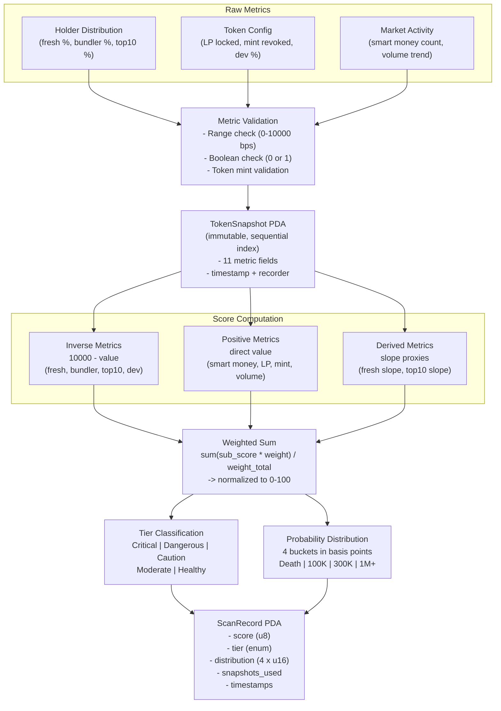

# kova-core

<p align="center">
  
</p>

<p align="center">
  Token survival probability scanner for Solana.
</p>

<p align="center">
  <a href="https://kova.camp"></a>
  <a href="https://x.com/kovadotcamp"></a>
</p>

<p align="center">
  <a href="https://github.com/kovacamp/kova/actions"></a>
  
  
  
  
</p>

---

Kova quantifies how likely a Solana token is to survive using a multi-factor
scoring algorithm. It captures on-chain metrics, computes a weighted survival
score (0--100), and derives a probability distribution across four market-cap
outcomes.

Everything runs on integer arithmetic with overflow checks. No floating point
anywhere in the stack.

## Feature Engineering

Kova evaluates tokens across **10 weighted sub-scores** derived from real-time
on-chain metrics:

| Factor | Direction | What It Measures |
|--------|-----------|-----------------|
| Fresh Wallet % | Inverse | Proportion of holders with new wallets |
| Bundler % | Inverse | Proportion flagged as sniper/bundler activity |
| Top 10 Holder % | Inverse | Concentration in the top 10 wallets |
| Dev Holdings % | Inverse | Developer wallet retention |
| Smart Money Count | Positive | Number of tracked smart-money wallets holding |
| LP Locked | Positive | Whether liquidity pool is locked |
| Mint Revoked | Positive | Whether mint authority is revoked |
| Volume Trend | Positive | Directional volume movement |
| Fresh Wallet Slope | Derived | Rate of change in fresh wallet concentration |
| Top 10 Slope | Derived | Rate of change in top-holder concentration |

Inverse factors penalize high values. Positive factors reward them. Derived
factors track time-series momentum.

## Architecture



## Score Tiers

| Score | Tier | Label |
|-------|------|-------|
| 0 -- 19 | Critical | Extreme risk |
| 20 -- 39 | Dangerous | High risk |
| 40 -- 59 | Caution | Moderate risk |
| 60 -- 79 | Moderate | Lower risk |
| 80 -- 100 | Healthy | Lowest observed risk |

## Scoring Weights

All weights are in basis points (sum = 10,000 = 100%).

| Factor | Default Weight | bps |
|--------|---------------|-----|
| Fresh Wallet % | 20% | 2000 |
| Bundler % | 15% | 1500 |
| Top 10 Holder % | 15% | 1500 |
| Smart Money | 10% | 1000 |
| Dev Holdings | 10% | 1000 |
| LP Locked | 10% | 1000 |
| Mint Revoked | 5% | 500 |
| Volume Trend | 5% | 500 |
| Fresh Wallet Slope | 5% | 500 |
| Top 10 Slope | 5% | 500 |

Weights are on-chain and adjustable via `update_config` by the config authority.

## Probability Distribution

Given a score, Kova maps it to a four-bucket distribution (basis points,
sum = 10,000):

| Bucket | Formula |
|--------|---------|
| Death (rug / fade) | `max(0, 9500 - score * 80)` |
| Reach 100K mcap | `min(score * 30, 2500)` |
| Reach 300K mcap | `min(max(0, (score - 40) * 20), 1500)` |
| Reach 1M+ mcap | remainder to 10,000 |

Example at score 72:

```
Death     17.4%  ████████▋
100K      21.6%  ██████████▊
300K      6.4%   ███▏
1M+       54.6%  ███████████████████████████▎
```

## Data Pipeline


